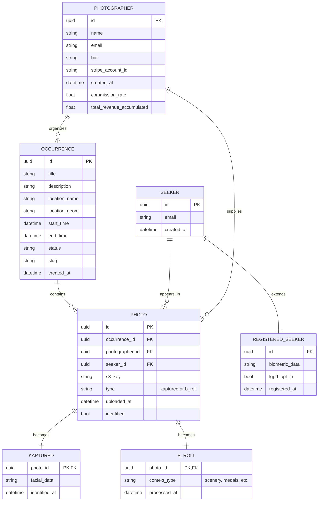
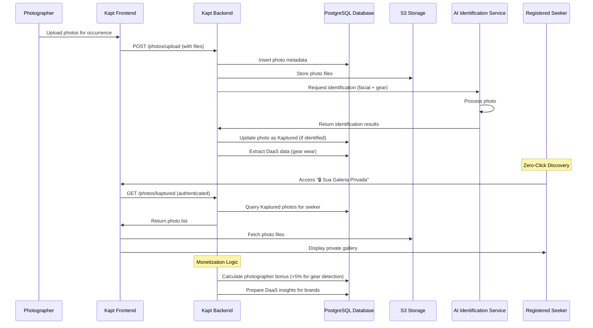

# Kapt System Design & Architecture

This document outlines the high-level system architecture of the Kapt platform, focusing on the core components, data relationships, and key workflows. All designs adhere to the Kapt domain rules, ensuring privacy compliance, DaaS monetization, and zero-click discovery for registered seekers.

## Container Architecture (C4 Level 2)

The following diagram illustrates the container-level interactions within the Kapt ecosystem. The system is designed for scalability, with clear separation of concerns between user-facing interfaces, business logic, data storage, and AI processing.

```mermaid
container C4Context {
    Person[Photographer] --> Frontend : Uploads photos
    Person[Registered Seeker] --> Frontend : Discovers photos
    Person[Promoter] --> Frontend : Manages occurrences

    System_Boundary(kapt_platform, "Kapt Platform") {
        Container(frontend, "Kapt Frontend", "Next.js", "Provides web interface for seekers, photographers, and promoters")
        Container(backend, "Kapt Backend", "Go", "Handles business logic, authentication, and API orchestration")
        ContainerDb(database, "PostgreSQL Database", "PostgreSQL", "Stores occurrences, seekers, photographers, and photo metadata")
        Container(storage, "S3 Storage", "Object Storage", "Stores photo files and B-roll content")
        Container(ai_service, "AI Identification Service", "AI/ML Service", "Processes photos for identification and gear detection")
    }

    frontend --> backend : HTTP/REST
    backend --> database : SQL queries
    backend --> storage : File uploads/downloads
    backend --> ai_service : Photo analysis requests
    ai_service --> backend : Identification results
}
```

### Container Descriptions

- **Kapt Frontend (Next.js)**: The user-facing web application built with Next.js, providing interfaces for photographers to upload photos, registered seekers to access their private galleries, and promoters to manage occurrences. Strictly enforces PT-BR localization and LGPD compliance.
- **Kapt Backend (Go)**: The core API server written in Go, implementing business rules such as OTP verification, photo processing orchestration, and DaaS data extraction. Ensures zero-click discovery for registered seekers.
- **PostgreSQL Database**: Relational database storing all domain entities including occurrences, seekers, photographers, and photo metadata. Supports complex queries for photo identification and monetization analytics.
- **S3 Storage**: Object storage system for persisting photo files and B-roll content. Provides scalable, secure storage with access controls aligned to privacy rules.
- **AI Identification Service**: Specialized service for processing uploaded photos, performing facial recognition for Kaptured photos, and gear detection for DaaS insights. Only processes photos after LGPD opt-in verification.

## Entity-Relationship Diagram (ERD)

The ERD below maps the core domain entities and their relationships, derived from the Kapt glossary and business rules. All relationships enforce privacy constraints and support the DaaS monetization model.



### Entity Descriptions

- **Occurrence**: Central entity representing a physical event or cobertura. Managed by promoters and contains photos from photographers.
- **Seeker**: Guest end-user attending occurrences. Can become a registered seeker with biometric data and LGPD opt-in.
- **Registered Seeker**: Extended seeker with saved biometrics, enabling zero-click discovery of their Kaptured photos.
- **Photographer**: Professional creator supplying photos for occurrences. Receives incentives based on gear detection success.
- **Photo**: Core asset uploaded by photographers, either becoming Kaptured (identified) or B-roll (contextual).
- **Kaptured**: Successfully identified photo with facial recognition data, only accessible to the registered seeker after LGPD compliance.
- **B-roll**: Atmospheric photos bundled into "Pack de Recordação" for monetization, never sold individually.

## 'Kaptured' Sequence Diagram

The sequence diagram details the end-to-end flow for creating and discovering Kaptured photos, from photographer upload through AI processing to registered seeker discovery. This workflow strictly adheres to privacy rules and zero-click discovery.



### Sequence Description

1. **Upload Phase**: Photographer uploads photos via the frontend, which are stored in S3 and metadata saved in PostgreSQL.
2. **Processing Phase**: Backend sends photos to AI service for identification. Successful identification creates Kaptured entries with facial data.
3. **DaaS Extraction**: Gear detection data is extracted for monetization, triggering photographer incentives.
4. **Discovery Phase**: Registered seekers automatically see their Kaptured photos in the private gallery without manual search, per zero-click discovery rule.
5. **Privacy Enforcement**: All access requires LGPD opt-in and authentication; no public galleries exist.

This architecture ensures the Kapt platform delivers on its core promise of private, automated photo discovery while enabling DaaS revenue streams.