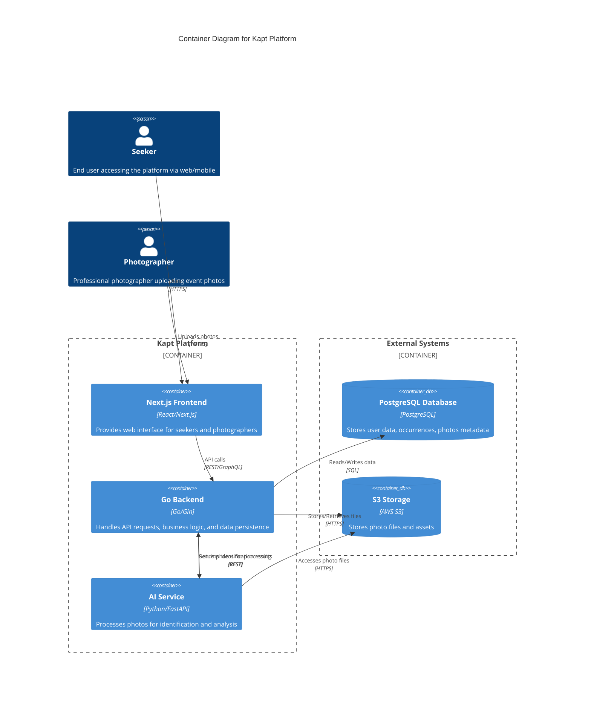
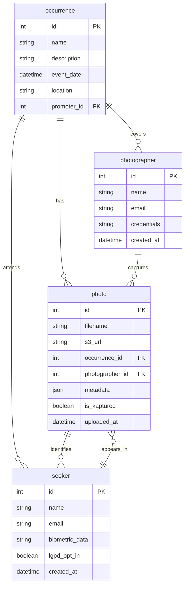
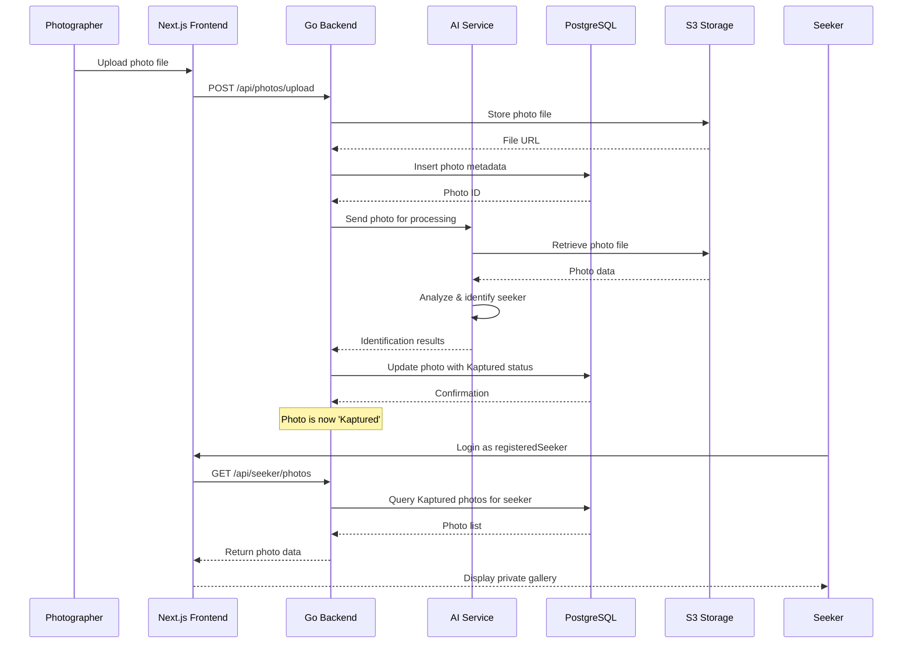

# System Design & Architecture

This document outlines the high-level system design and architecture of the Kapt platform, including container interactions, data relationships, and key workflows.

## Container Architecture (C4 Level 2)

The following diagram illustrates the container-level architecture of the Kapt system, showing the main containers and their interactions.

## Entity-Relationship Diagram (ERD)

The ERD below shows the key entities and their relationships in the Kapt system.

## 'Kaptured' Sequence Diagram

The sequence diagram illustrates the data flow from photo upload to 'Zero-Click Discovery' for a registeredSeeker.

## Component Responsibilities

### Next.js Frontend
- **Responsibility**: Provides the web interface for seekers and photographers, handling user interactions and displaying data.
- **Backend Integration**: Communicates with the Go Backend via REST/GraphQL APIs for data retrieval and submission.
- **Data Persistence**: Does not handle data persistence directly; relies on backend for all database operations.

### Go Backend
- **Responsibility**: Implements business logic, API endpoints, and orchestrates interactions between services.
- **Backend Integration**: Serves as the central hub, integrating with PostgreSQL for data operations, S3 for file storage, and AI Service for photo processing.
- **Data Persistence**: Manages all CRUD operations on PostgreSQL, ensuring data consistency and enforcing business rules.

### PostgreSQL Database
- **Responsibility**: Stores structured data including user profiles, occurrences, photos metadata, and relationships.
- **Backend Integration**: Connected to Go Backend via SQL queries generated by sqlc.
- **Data Persistence**: Primary data store, ensuring ACID compliance and referential integrity.

### S3 Storage
- **Responsibility**: Stores photo files and other assets in a scalable, durable object storage system.
- **Backend Integration**: Accessed by Go Backend for file uploads/downloads and by AI Service for photo analysis.
- **Data Persistence**: Provides long-term storage with high availability and low latency access.

### AI Service
- **Responsibility**: Processes uploaded photos to identify seekers using biometric data and machine learning algorithms.
- **Backend Integration**: Receives photo processing requests from Go Backend and returns identification results.
- **Data Persistence**: Does not persist data directly; relies on backend for storing processed results in PostgreSQL.